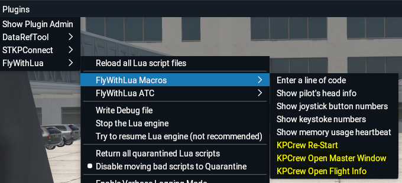

# KPCrew 2.2-alpha3 (12/2021)
FlyWithLua scripts to simulate a virtual first officer in X-Plane 11. THIS IS A COMPLETE REWRITE AND STILL IN ALPHA. PLEASE REMOVE ANY OLDER KPCREW FILES FROM SCRIPTS AND MODULES FOLDER!

## Introduction
Coming from the FSX/P3D world I know the FS2Crew products which I had for all payware aircraft if available. I always wished that I could get something like that for X-Plane. FlyWithLua turned out to be a great programming environment for X-Plane and I decided to try replicating something like FS2Crew for the Zibo B738. 

Why the Zibo? Because it is the most accessible and function-rich freeware aircraft in X-Plane and I love the Boeing 737s.

### What does it do? 

Basically you have a helping hand, a virtual first officer which is able to run procedures on your command. These procedures are as close as I can have them to real procedures, partially I get inspiration from FS2Crew (a great tool I would always recommend).

There are other tools out there which do similar things, the most versatile one being XFirstOfficer. I had a KPCrew version with XFirstOfficer but it turned out a lot of work and although quite versatile, restricted me at some locations due to the way the steps are defined. Still XFirstOfficer is great and I can recommend it to people who want to quickly bring together small procedures without programming.

Having said that, KPCrew is one big programming exercise and I can understand that it will be difficult for people without experience in Lua programming to change or extend things. If you want to do that then look at other tools as mentioned above.

### Other Aircraft Supported?

Will there be other aircraft? Yes, it will also contain the FJS B737-200 and many other planes if I have the addon and find the time to research it.

### History of KPCrew
KPCrew went through several iterations, initially I called it Zibocrew. The initial concept was clunky and inflexible. I think I now have a good enough concept to easily extend the scripts. I even have now background events. As it is with Lua, you can see all that I did but when you change code you are on your own – I will not have the time to support this or hold hands with the installation. This is one of the reasons why I hesitated to release this publicly.

## Changes
TBD

## Installation

### Prerequisites
You need to have the freeware FlyWithLua NG plugin minimum version 2.7 but I recommend to download the latest version. See [FlyWithLua on the Forum](https://forums.x-plane.org/index.php?/files/file/38445-flywithlua-ng-next-generation-edition-for-x-plane-11-win-lin-mac/) 

And get yourself BetterPushback if you really are one of those that have missed out on this great tool :-) [BetterPushback](https://github.com/skiselkov/BetterPushbackC/releases)

### The KPCrew-x.x.x.zip File
KPCrew comes in a Zip-file and needs to be manually installed under your X-Plane-11 folder. The ZIP contains the following folders:
- kpcrew
  - aircraft  --> contains aircraft specific files such as Flows or Honeycomb profiles
    - KPCrew v2.2 B738 Flows.pdf --> current flows and checklists for Zibo Mod
    - KPCREW Alpha Default.json --> a generic Honeycomb Alpha profile - works only with KPCrew
    - KPCREW Bravo Profile.json --> a generic Honeycomb Bravo profile - works only with KPCrew
  - documentation  --> documentation for KPCrew
    - KPCrew Flows.xlsx  --> The Flows for all supported aircraft
    - manual.md  --> this manual
    - manual.pdf  --> PDF version of this manual
  - modules  --> files to go in the FlyWithlua module folder; all the KPCrew and aircraft modules
    - B738_kpcrew.lua  --> the Zibo Mod Being 738 module
    - kpcrew_imgui.lua  --> All the windows and dialogs of KPCrew
    - kpcrew_checklists.lua  --> all the checklist related functionality
    - kpcrew_data.lua  --> all the data and configuration related functionality
    - kpcrew_config.lua  --> the base configuration - do not change; use Save and Load to have your own
  - scripts  -->  files to go in the FlyWithlua module folder; the main lua script
    - kpcrew2.lua  --> the main script to start KPCrew with supported aircraft
  - readme.md  --> a readme file
  - LICENSE  --> the license terms

### How to Install
Modules and Scripts are FlyWithLua specific folders. Find them  here:

- Your X-Plane-11 Root Folder
  - Resources
    - plugins
      - FlyWithLua
        - scripts  --> put kpcrew2.lua here (overwrite older versions)
        - modules  --> put all lua files in modules folder here

**Make sure that you removed any older files from previous versions of KPCrew (2, 2.1 and 1.x also called Zibocrew)**

### How to Uninstall
Simply remove all the above lua files from the **scripts** and **modules** folder.

## How does it Work?

### Startup
Once you have installed the lua files in the correct places, next time your X-Plane starts it will also automatically start KPCrew. If you have loaded one of the supported aircraft add-ons (currently the Zibo Mod B738) you will see the control window showing on the bottom of the XP11 screen. By default it is a floating window you can move and even bring out onto another screen.

### The Control Window

These are the elements of the Control Window:

 - **[M]**: Master button; the most used button in KPCrew, start procedures and move through the steps with a click
 - **[Left instructions & checklist item display]**: Shows the current step/instruction. Blinks when interactive item
 - **[P]**: Pause button; pauses the execution of a procedure or checklist
 - **[S]**: Stop button; Cancels the execution of procedure or checklist
 - **[<]**: Previous button; Allows you to move through the available procedures/checklists, in this case backward
 - **[>]**: Next button; Allows you to move through the available procedures/checklists, in this case forward
 - **[@]**: Flight Information/Configuration Window; Open the window to enter data, read briefings and configure KPCrew
 - **[L]**: Procedure List Item window: Debug window to see content of procedures while they are being executed
	
### X-Plane Commands

You can assign commands to buttons or keys for most of the above items:

 - **kp/crew/master_button** = KPCrew Master Button
 - **kp/crew/secondary_button** = KPCrew Secondary Button
 - **kp/crew/next_button** = KPCrew Next Button
 - **kp/crew/previous_button** = KPCrew Previous Button
 - **kp/crew/info_window** = KPCrew Information Window
	
### FlyWithLua Macros

You can also perform certain actions from the FlyWithLua Macro section:

 - **KPCrew Re-Start** starts the whole script again
 - **KPCrew Open Master Window** Opens the Control Window
 - **KPCrew Open Flight Info** opens the Flight information/configuration window
	
